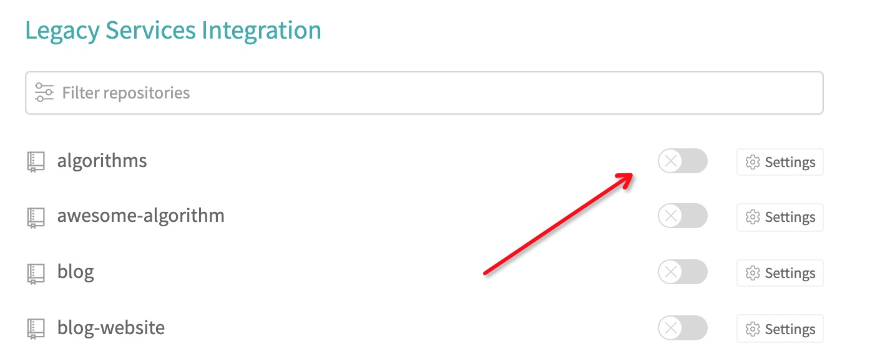
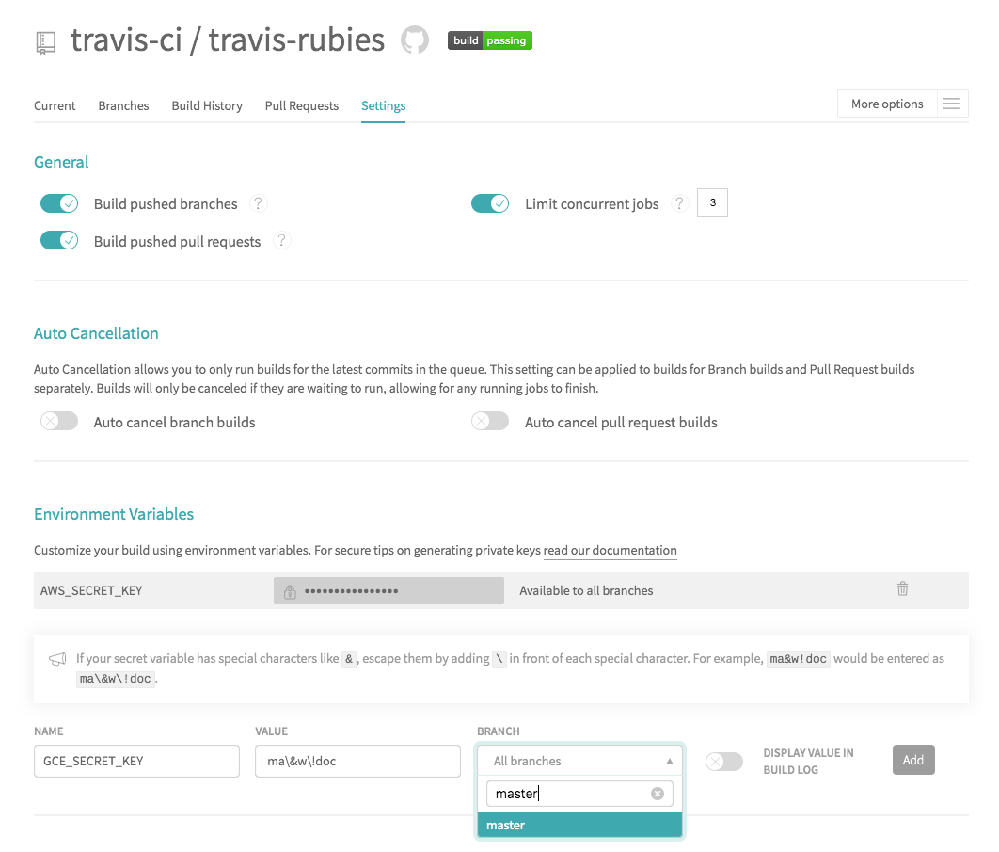
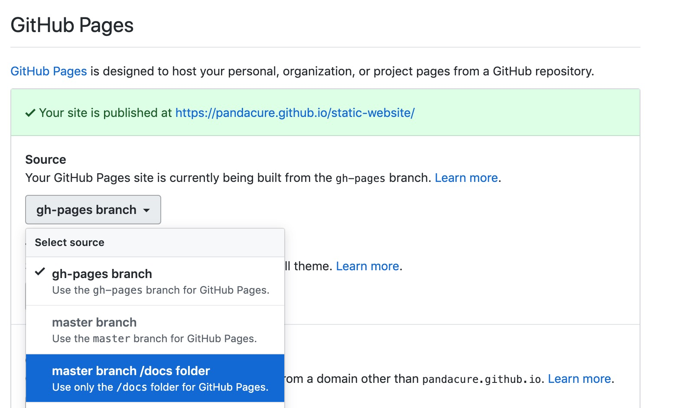

# Travis自动化部署VuePress到Github Pages

## VuePress准备

可以参考[VuePress](https://vuepress.vuejs.org/zh/)官网的最新配置，也可以参考下面代码来最快体验`VuePress`
``` js {1,2}
# 新建一个 docs 文件夹 (为什么是docs呢 其实这里可以是别的名字 但是你用docs会带来一个好处后续会讲)
mkdir docs

# 初始化npm git
npm init -y
git init

# 将 VuePress 作为一个本地依赖安装
yarn add -D vuepress # 或者：npm install -D vuepress

# 新建一个 markdown 文件
echo '# Hello VuePress!' > docs/README.md
```

修改`package.json`文件里面的`scripts`

``` js
{
  "scripts": {
    "docs:dev": "vuepress dev docs",
    "docs:build": "vuepress build docs"
  }
}
```

运行项目`yarn docs:dev`或者`npm run docs:dev`

这里是最简单的启动项目 如果想要配置导航，侧边栏等。可以去看文档或者看我的`VuePress`进阶教学（创作中）

## Travis配置

Travis CI是在软件开发领域中的一个在线的，分布式的持续集成服务，用来构建及测试在GitHub托管的代码。这个软件的代码同时也是开源的，可以在GitHub上下载到，尽管开发者当前并不推荐在闭源项目中单独使用它。来自[维基百科](https://zh.wikipedia.org/wiki/Travis_CI)。还有一个好处是它打包完成后直接将你的静态文件部署到`GitHub Pages`

#### 注册Travis CI

目前`GitHub Pages`只支持`GitHub`且你必须是项目的`Owner`,目前Travis有两个版本，[收费版本](https://travis-ci.com/)和[免费版本](https://travis-ci.org/)，这里使用的免费版本，登录免费版[travis-ci.org](https://travis-ci.org/) ，点击`SIGN UP`，用`Github`账号登录。

#### 选择需要持续集成的仓库

travis-ci 会列出你所有的仓库，选择需要 travis-ci 帮你持续集成的仓库。如下图打开开关激活



在项目的根目录新增`.travis.yml`配置文件, 用来打包和部署文件
``` yml {12,14}
language: node_js
node_js:
- lts/*
install:
- yarn install
script:
- yarn docs:build
deploy:
  provider: pages
  skip_cleanup: true
  local_dir: docs/.vuepress/dist
  github_token: "$GITHUB_TOKEN"
  keep_history: true,
  target_branch: 'xxxx' // 这个是你自己想要push代码的分支
  on:
    branch: master
```
#### 为什么要创建`GITHUB_TOKEN`

因为要部署`GitHub Pages`，所以它需要权限将打包静态文件推送到`GitHub`仓库，所以需要申请权限，当然你可以直接将申请的权限写到配置文件中，但是我想你不会这么做。你可以看[文档](https://docs.travis-ci.com/user/deployment/pages/)深入了解，也可以直接看下面的操作

#### 怎么创建`GITHUB_TOKEN`

首先我们创建[Github Token](https://help.github.com/en/github/authenticating-to-github/creating-a-personal-access-token-for-the-command-line)

#### 怎么使用`GITHUB_TOKEN`

- 方法一：在持续集成仓库设置环境变量

你可以在你刚才申请持续集成的仓库下创建环境变量，也可以限制在某一个分支下使用


- 方法二：加密`GITHUB_TOKEN`

1、请使用`gem install travis (or brew install travis on macOS)`确保安装`travis`

2、本文使用的是免费的travis,所以在项目的根目录使用以下命令,如果你使用的是付费版，请查看文档[收费版加密操作](https://docs.travis-ci.com/user/encryption-keys#usage)
```shell
 travis encrypt MY_SECRET_ENV=super_secret --add env.global
```
3、提交`.travis.yml`到`git`仓库

注意：这里可能需要登录，我没有遇到过，如果需要登录输入`GitHub`信息即可

## Github Pages配置

> 使用[github page](https://pages.github.com/), 快速部署你的静态网页, 白嫖 不用白不用

#### 为什么使用`Github Pages`

- 使用零成本: `github pages`集成在`github`中, 直接和代码管理绑定在一起, 随着代码更新自动重新部署, 使用非常方便.

- 免费: 免费提供`http://username.github.io`的域名, 免费的静态网站服务器.

- 无数量限制: `github pages`没有使用的数量限制, 每一个`github repository`都可以部署为一个静态网站.

#### 设置`Github Pages`

1、进入`github`仓库，选择选择设置的`target_branch`的值的分支

2、点击`setting`，找到`github page`选项，选择设置的`target_branch`的值，当然你也可以选择图片的蓝色部分的选项，但是你必须保证`docs`文件下有`index.html`，这也是上面提到创建一个docs文件的好处，至于这用部署还有一种方式，[文档地址](https://vuepress.vuejs.org/zh/guide/deploy.html#github-pages)



## 书写`vuepress`注意事项

- 代码行高亮的行号中不能有空格
- markdown里面使用图片是相对路径
